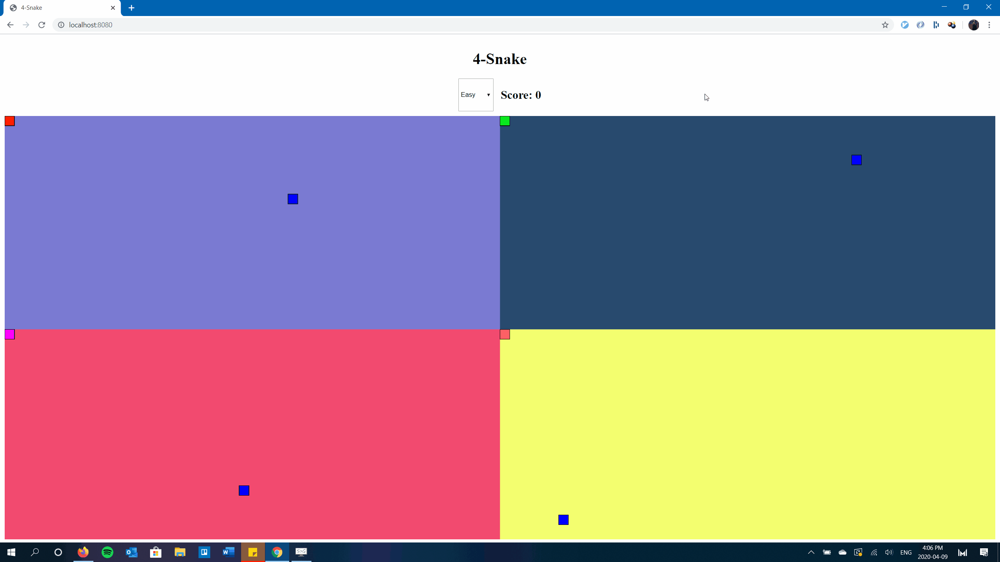

# 4-Snake

4-Snake is a simple game with a unique take on the timeless classic. Instead of just 1, you're controlling 4 snakes at the same time on 4 different game boards! You can change the difficulty (speed) of the game to your preferences. Built with the JavScript [p5 library](https://github.com/processing/p5.js/).  

## Installation 

To try 4-Snake for yourself, just clone this git repository.

```bash
git clone https://github.com/Aradhya-B/4-Snake.git
```

## Usage

To play the game, you'll need to run a local web server. I suggest downloading the Node.js http-server module, but you can also use Python or PHP if you'd like.

```bash
npm install -g http-server
```

After you've installed the http-server module, just ```cd``` into the 4-Snake folder and type

```bash
http-server -c-1
```

Finally, navigate to ```http://localhost:8080/``` on your favorite browser and have fun!

*Note: If you resize your window while playing, just refresh the page and the game boards will adjust as well.*

## Demo


